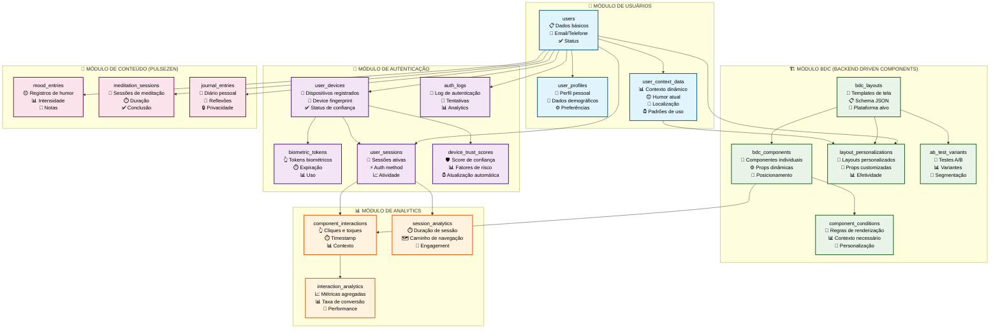
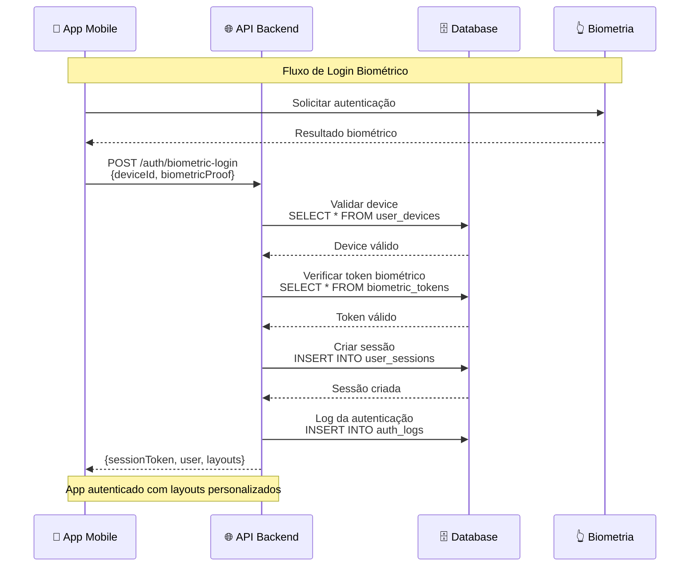
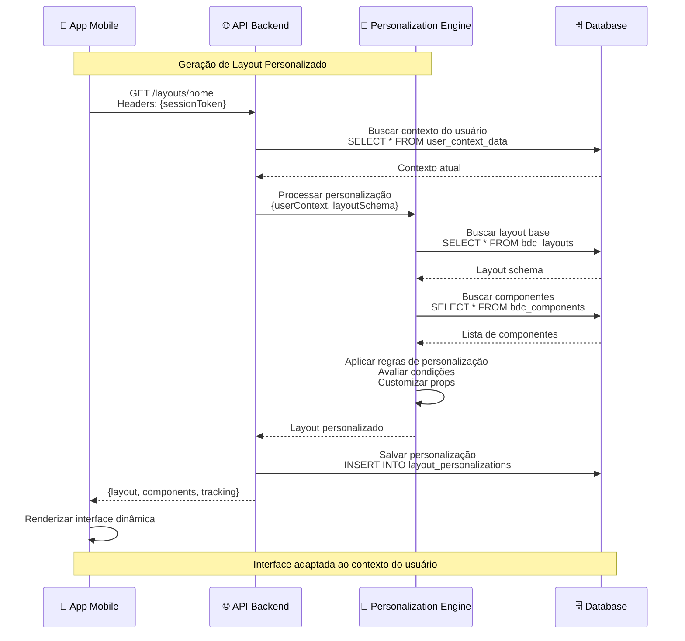
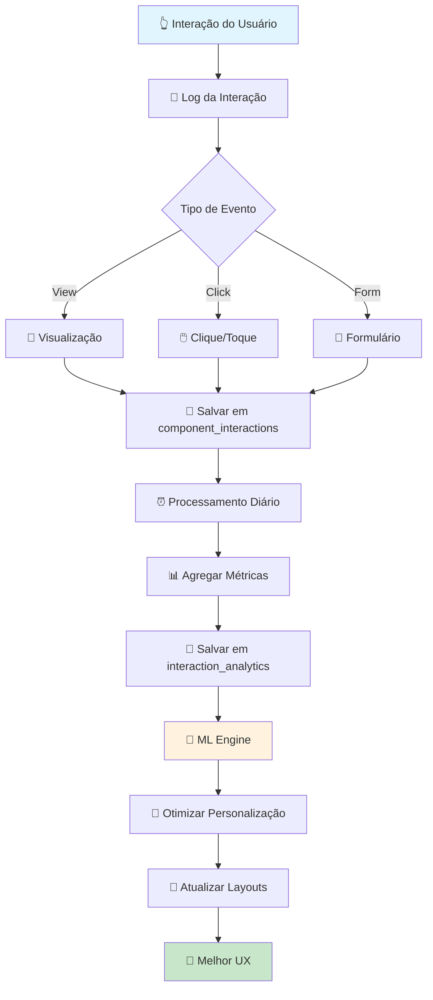
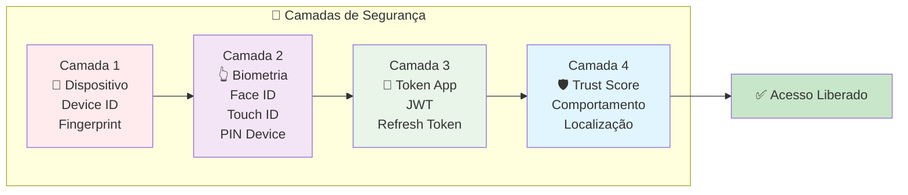
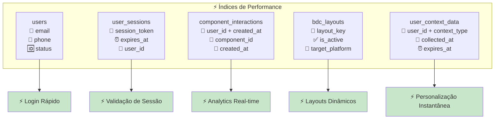
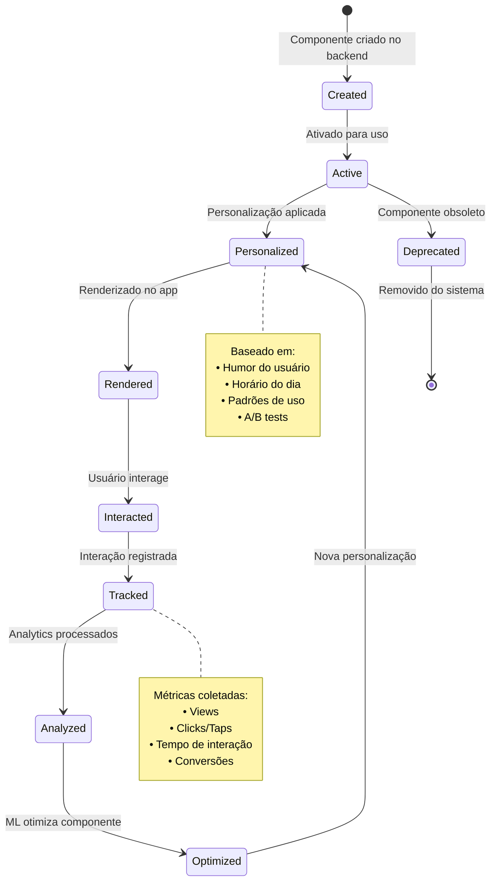

# 🖼️ DIAGRAMA VISUAL DO BANCO DE DADOS
**PulseZen: Arquitetura BDC + Autenticação Biométrica**

---

## 🎨 DIAGRAMA PRINCIPAL

---

## 🔄 FLUXO DE DADOS - AUTENTICAÇÃO BIOMÉTRICA

---

## 🎨 FLUXO DE DADOS - BDC PERSONALIZAÇÃO

---

## 📊 FLUXO DE ANALYTICS

---

## 🛡️ SEGURANÇA - CAMADAS DE PROTEÇÃO

---

## 🎯 OTIMIZAÇÃO - ÍNDICES PRINCIPAIS

---

## 🔄 CICLO DE VIDA - BDC COMPONENT

---

Este sistema de banco de dados foi projetado para suportar:

### 🎯 **FUNCIONALIDADES PRINCIPAIS:**
- ✅ **Autenticação biométrica** sem senhas tradicionais
- ✅ **Layouts dinâmicos** controlados pelo servidor
- ✅ **Personalização contextual** baseada em dados do usuário
- ✅ **Analytics comportamentais** para otimização contínua
- ✅ **A/B testing** nativo para experimentação
- ✅ **Trust scoring** para segurança avançada

### 🚀 **BENEFÍCIOS DE PERFORMANCE:**
- 📊 **Índices otimizados** para queries frequentes
- 🔄 **Caching estratégico** com Redis/Memcached
- 📈 **Particionamento** para escala horizontal
- ⚡ **Row Level Security** para dados sensíveis

### 🔐 **SEGURANÇA ROBUSTA:**
- 🛡️ **Multi-layer authentication** com 4 camadas
- 📝 **Audit trails** completos
- 🔒 **Dados criptografados** em repouso
- 👤 **Isolamento de dados** por usuário

Esta modelagem garante que o PulseZen tenha uma base sólida para crescer e competir com os melhores apps do mercado! 🎯
