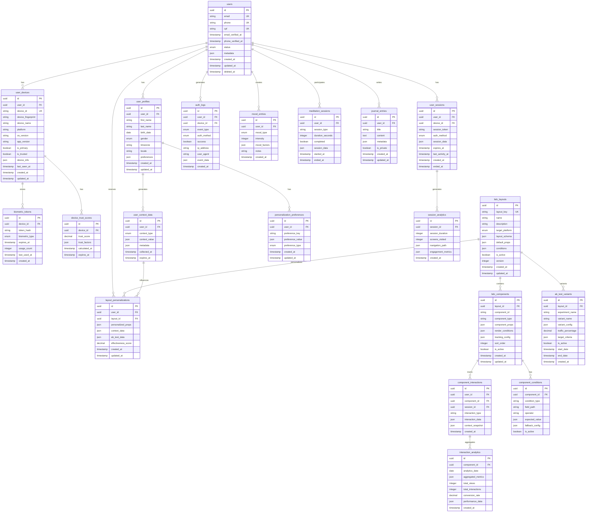

# 🗄️ MODELAGEM DO BANCO DE DADOS
**PulseZen: BDC + Autenticação Biométrica**

---

## 🎯 VISÃO GERAL

Esquema de banco de dados otimizado para suportar:
- **🔐 Autenticação biométrica** sem senhas tradicionais
- **🏗️ Arquitetura BDC** com layouts dinâmicos
- **🎨 Personalização contextual** baseada em dados do usuário
- **📊 Analytics comportamentais** para otimização

---

## 📋 DIAGRAMA ENTIDADE-RELACIONAMENTO



---

## 🔐 MÓDULO DE AUTENTICAÇÃO

### **1. Tabela `users` - Usuários Principais**

```sql
CREATE TABLE users (
    id UUID PRIMARY KEY DEFAULT gen_random_uuid(),
    email VARCHAR(255) UNIQUE NOT NULL,
    phone VARCHAR(20) UNIQUE,
    cpf VARCHAR(11) UNIQUE,
    email_verified_at TIMESTAMP,
    phone_verified_at TIMESTAMP,
    status user_status_enum NOT NULL DEFAULT 'pending_verification',
    metadata JSONB DEFAULT '{}',
    created_at TIMESTAMP DEFAULT CURRENT_TIMESTAMP,
    updated_at TIMESTAMP DEFAULT CURRENT_TIMESTAMP,
    deleted_at TIMESTAMP NULL
);

CREATE TYPE user_status_enum AS ENUM (
    'pending_verification',
    'active',
    'suspended',
    'deactivated'
);

-- Índices para performance
CREATE INDEX idx_users_email ON users(email);
CREATE INDEX idx_users_phone ON users(phone);
CREATE INDEX idx_users_status ON users(status);
CREATE INDEX idx_users_created_at ON users(created_at);
```

### **2. Tabela `user_devices` - Dispositivos dos Usuários**

```sql
CREATE TABLE user_devices (
    id UUID PRIMARY KEY DEFAULT gen_random_uuid(),
    user_id UUID NOT NULL REFERENCES users(id) ON DELETE CASCADE,
    device_id VARCHAR(255) UNIQUE NOT NULL, -- ID único do dispositivo
    device_fingerprint TEXT NOT NULL, -- Hash das características do device
    device_name VARCHAR(255),
    platform device_platform_enum NOT NULL,
    os_version VARCHAR(50),
    app_version VARCHAR(50),
    is_primary BOOLEAN DEFAULT FALSE,
    is_trusted BOOLEAN DEFAULT FALSE,
    device_info JSONB DEFAULT '{}',
    last_seen_at TIMESTAMP DEFAULT CURRENT_TIMESTAMP,
    created_at TIMESTAMP DEFAULT CURRENT_TIMESTAMP,
    updated_at TIMESTAMP DEFAULT CURRENT_TIMESTAMP
);

CREATE TYPE device_platform_enum AS ENUM ('ios', 'android', 'web');

-- Índices
CREATE INDEX idx_user_devices_user_id ON user_devices(user_id);
CREATE INDEX idx_user_devices_device_id ON user_devices(device_id);
CREATE INDEX idx_user_devices_is_trusted ON user_devices(is_trusted);
```

### **3. Tabela `biometric_tokens` - Tokens Biométricos**

```sql
CREATE TABLE biometric_tokens (
    id UUID PRIMARY KEY DEFAULT gen_random_uuid(),
    device_id UUID NOT NULL REFERENCES user_devices(id) ON DELETE CASCADE,
    token_hash VARCHAR(255) NOT NULL, -- Hash do token biométrico
    biometric_type biometric_type_enum NOT NULL,
    expires_at TIMESTAMP NOT NULL,
    usage_count INTEGER DEFAULT 0,
    last_used_at TIMESTAMP,
    created_at TIMESTAMP DEFAULT CURRENT_TIMESTAMP
);

CREATE TYPE biometric_type_enum AS ENUM (
    'fingerprint',
    'face_id',
    'iris',
    'device_pin',
    'pattern'
);

-- Índices
CREATE INDEX idx_biometric_tokens_device_id ON biometric_tokens(device_id);
CREATE INDEX idx_biometric_tokens_expires_at ON biometric_tokens(expires_at);
```

### **4. Tabela `user_sessions` - Sessões de Usuário**

```sql
CREATE TABLE user_sessions (
    id UUID PRIMARY KEY DEFAULT gen_random_uuid(),
    user_id UUID NOT NULL REFERENCES users(id) ON DELETE CASCADE,
    device_id UUID NOT NULL REFERENCES user_devices(id) ON DELETE CASCADE,
    session_token VARCHAR(255) UNIQUE NOT NULL,
    auth_method auth_method_enum NOT NULL,
    session_data JSONB DEFAULT '{}',
    expires_at TIMESTAMP NOT NULL,
    last_activity_at TIMESTAMP DEFAULT CURRENT_TIMESTAMP,
    created_at TIMESTAMP DEFAULT CURRENT_TIMESTAMP,
    ended_at TIMESTAMP NULL
);

CREATE TYPE auth_method_enum AS ENUM (
    'biometric',
    'device_pin',
    'email_verification',
    'phone_verification',
    'manual_recovery'
);

-- Índices
CREATE INDEX idx_user_sessions_user_id ON user_sessions(user_id);
CREATE INDEX idx_user_sessions_session_token ON user_sessions(session_token);
CREATE INDEX idx_user_sessions_expires_at ON user_sessions(expires_at);
```

---

## 🏗️ MÓDULO BDC (BACKEND DRIVEN COMPONENTS)

### **5. Tabela `bdc_layouts` - Layouts Dinâmicos**

```sql
CREATE TABLE bdc_layouts (
    id UUID PRIMARY KEY DEFAULT gen_random_uuid(),
    layout_key VARCHAR(100) UNIQUE NOT NULL, -- ex: 'home_screen', 'onboarding_flow'
    name VARCHAR(255) NOT NULL,
    description TEXT,
    target_platform platform_target_enum NOT NULL,
    layout_schema JSONB NOT NULL, -- Schema do layout em JSON
    default_props JSONB DEFAULT '{}',
    conditions JSONB DEFAULT '{}', -- Condições para renderização
    is_active BOOLEAN DEFAULT TRUE,
    version INTEGER DEFAULT 1,
    created_at TIMESTAMP DEFAULT CURRENT_TIMESTAMP,
    updated_at TIMESTAMP DEFAULT CURRENT_TIMESTAMP
);

CREATE TYPE platform_target_enum AS ENUM ('mobile', 'web', 'all');

-- Índices
CREATE INDEX idx_bdc_layouts_layout_key ON bdc_layouts(layout_key);
CREATE INDEX idx_bdc_layouts_is_active ON bdc_layouts(is_active);
CREATE INDEX idx_bdc_layouts_target_platform ON bdc_layouts(target_platform);
```

### **6. Tabela `bdc_components` - Componentes dos Layouts**

```sql
CREATE TABLE bdc_components (
    id UUID PRIMARY KEY DEFAULT gen_random_uuid(),
    layout_id UUID NOT NULL REFERENCES bdc_layouts(id) ON DELETE CASCADE,
    component_id VARCHAR(100) NOT NULL, -- ID único dentro do layout
    component_type VARCHAR(100) NOT NULL, -- ex: 'button', 'card', 'list'
    component_props JSONB DEFAULT '{}',
    render_conditions JSONB DEFAULT '{}',
    tracking_config JSONB DEFAULT '{}',
    sort_order INTEGER DEFAULT 0,
    is_active BOOLEAN DEFAULT TRUE,
    created_at TIMESTAMP DEFAULT CURRENT_TIMESTAMP,
    updated_at TIMESTAMP DEFAULT CURRENT_TIMESTAMP
);

-- Índices
CREATE INDEX idx_bdc_components_layout_id ON bdc_components(layout_id);
CREATE INDEX idx_bdc_components_component_type ON bdc_components(component_type);
CREATE INDEX idx_bdc_components_sort_order ON bdc_components(sort_order);
```

### **7. Tabela `layout_personalizations` - Personalizações por Usuário**

```sql
CREATE TABLE layout_personalizations (
    id UUID PRIMARY KEY DEFAULT gen_random_uuid(),
    user_id UUID NOT NULL REFERENCES users(id) ON DELETE CASCADE,
    layout_id UUID NOT NULL REFERENCES bdc_layouts(id) ON DELETE CASCADE,
    personalized_props JSONB DEFAULT '{}', -- Props personalizadas
    context_data JSONB DEFAULT '{}', -- Contexto usado para personalização
    ab_test_data JSONB DEFAULT '{}', -- Dados de A/B testing
    effectiveness_score DECIMAL(3,2), -- Score de 0 a 1
    created_at TIMESTAMP DEFAULT CURRENT_TIMESTAMP,
    updated_at TIMESTAMP DEFAULT CURRENT_TIMESTAMP,
    
    UNIQUE(user_id, layout_id)
);

-- Índices
CREATE INDEX idx_layout_personalizations_user_id ON layout_personalizations(user_id);
CREATE INDEX idx_layout_personalizations_effectiveness_score ON layout_personalizations(effectiveness_score);
```

---

## 🎨 MÓDULO DE PERSONALIZAÇÃO

### **8. Tabela `user_context_data` - Contexto do Usuário**

```sql
CREATE TABLE user_context_data (
    id UUID PRIMARY KEY DEFAULT gen_random_uuid(),
    user_id UUID NOT NULL REFERENCES users(id) ON DELETE CASCADE,
    context_type context_type_enum NOT NULL,
    context_value JSONB NOT NULL,
    metadata JSONB DEFAULT '{}',
    collected_at TIMESTAMP DEFAULT CURRENT_TIMESTAMP,
    expires_at TIMESTAMP -- Para dados temporários
);

CREATE TYPE context_type_enum AS ENUM (
    'mood',
    'location',
    'time_of_day',
    'device_usage',
    'app_usage',
    'preferences',
    'behavioral_pattern'
);

-- Índices
CREATE INDEX idx_user_context_data_user_id ON user_context_data(user_id);
CREATE INDEX idx_user_context_data_context_type ON user_context_data(context_type);
CREATE INDEX idx_user_context_data_collected_at ON user_context_data(collected_at);
```

### **9. Tabela `component_interactions` - Interações com Componentes**

```sql
CREATE TABLE component_interactions (
    id UUID PRIMARY KEY DEFAULT gen_random_uuid(),
    user_id UUID NOT NULL REFERENCES users(id) ON DELETE CASCADE,
    component_id UUID NOT NULL REFERENCES bdc_components(id) ON DELETE CASCADE,
    session_id UUID NOT NULL REFERENCES user_sessions(id) ON DELETE CASCADE,
    interaction_type interaction_type_enum NOT NULL,
    interaction_data JSONB DEFAULT '{}',
    context_snapshot JSONB DEFAULT '{}', -- Contexto no momento da interação
    created_at TIMESTAMP DEFAULT CURRENT_TIMESTAMP
);

CREATE TYPE interaction_type_enum AS ENUM (
    'view',
    'click',
    'tap',
    'swipe',
    'long_press',
    'scroll',
    'form_submit',
    'error'
);

-- Índices
CREATE INDEX idx_component_interactions_user_id ON component_interactions(user_id);
CREATE INDEX idx_component_interactions_component_id ON component_interactions(component_id);
CREATE INDEX idx_component_interactions_created_at ON component_interactions(created_at);
```

---

## 📊 MÓDULO DE ANALYTICS

### **10. Tabela `interaction_analytics` - Analytics Agregados**

```sql
CREATE TABLE interaction_analytics (
    id UUID PRIMARY KEY DEFAULT gen_random_uuid(),
    component_id UUID NOT NULL REFERENCES bdc_components(id) ON DELETE CASCADE,
    analytics_date DATE NOT NULL,
    aggregated_metrics JSONB NOT NULL,
    total_views INTEGER DEFAULT 0,
    total_interactions INTEGER DEFAULT 0,
    conversion_rate DECIMAL(5,4) DEFAULT 0,
    performance_data JSONB DEFAULT '{}',
    created_at TIMESTAMP DEFAULT CURRENT_TIMESTAMP,
    
    UNIQUE(component_id, analytics_date)
);

-- Índices
CREATE INDEX idx_interaction_analytics_analytics_date ON interaction_analytics(analytics_date);
CREATE INDEX idx_interaction_analytics_conversion_rate ON interaction_analytics(conversion_rate);
```

---

## 🧘 MÓDULO ESPECÍFICO DO PULSEZEN

### **11. Tabela `mood_entries` - Registros de Humor**

```sql
CREATE TABLE mood_entries (
    id UUID PRIMARY KEY DEFAULT gen_random_uuid(),
    user_id UUID NOT NULL REFERENCES users(id) ON DELETE CASCADE,
    mood_type mood_type_enum NOT NULL,
    intensity INTEGER CHECK (intensity >= 1 AND intensity <= 10),
    mood_factors JSONB DEFAULT '{}', -- Fatores que influenciaram o humor
    notes TEXT,
    created_at TIMESTAMP DEFAULT CURRENT_TIMESTAMP
);

CREATE TYPE mood_type_enum AS ENUM (
    'happy',
    'sad',
    'anxious',
    'calm',
    'energetic',
    'tired',
    'angry',
    'peaceful',
    'stressed',
    'motivated'
);
```

---

## 🔧 FUNÇÕES E TRIGGERS

### **1. Função para Atualizar Trust Score**

```sql
CREATE OR REPLACE FUNCTION update_device_trust_score(device_uuid UUID)
RETURNS VOID AS $$
DECLARE
    success_rate DECIMAL;
    usage_consistency DECIMAL;
    location_consistency DECIMAL;
    final_score DECIMAL;
BEGIN
    -- Calcular taxa de sucesso de autenticação
    SELECT 
        COALESCE(
            COUNT(CASE WHEN success THEN 1 END)::DECIMAL / 
            NULLIF(COUNT(*), 0), 
            0
        )
    INTO success_rate
    FROM auth_logs al
    JOIN user_devices ud ON al.device_id = ud.id
    WHERE ud.id = device_uuid
    AND al.created_at > CURRENT_TIMESTAMP - INTERVAL '30 days';
    
    -- Calcular consistência de uso (simplificado)
    usage_consistency := LEAST(success_rate * 1.2, 1.0);
    
    -- Score final (pode ser mais complexo)
    final_score := (success_rate * 0.6 + usage_consistency * 0.4);
    
    -- Inserir ou atualizar trust score
    INSERT INTO device_trust_scores (device_id, trust_score, trust_factors, calculated_at, expires_at)
    VALUES (
        device_uuid,
        final_score,
        jsonb_build_object(
            'success_rate', success_rate,
            'usage_consistency', usage_consistency
        ),
        CURRENT_TIMESTAMP,
        CURRENT_TIMESTAMP + INTERVAL '7 days'
    )
    ON CONFLICT (device_id) 
    DO UPDATE SET
        trust_score = EXCLUDED.trust_score,
        trust_factors = EXCLUDED.trust_factors,
        calculated_at = EXCLUDED.calculated_at,
        expires_at = EXCLUDED.expires_at;
END;
$$ LANGUAGE plpgsql;
```

### **2. Trigger para Auto-Atualização**

```sql
-- Trigger para atualizar updated_at automaticamente
CREATE OR REPLACE FUNCTION update_updated_at_column()
RETURNS TRIGGER AS $$
BEGIN
    NEW.updated_at = CURRENT_TIMESTAMP;
    RETURN NEW;
END;
$$ language 'plpgsql';

-- Aplicar trigger em tabelas relevantes
CREATE TRIGGER update_users_updated_at BEFORE UPDATE ON users 
    FOR EACH ROW EXECUTE FUNCTION update_updated_at_column();

CREATE TRIGGER update_user_devices_updated_at BEFORE UPDATE ON user_devices 
    FOR EACH ROW EXECUTE FUNCTION update_updated_at_column();

CREATE TRIGGER update_bdc_layouts_updated_at BEFORE UPDATE ON bdc_layouts 
    FOR EACH ROW EXECUTE FUNCTION update_updated_at_column();
```

---

## 🚀 QUERIES DE EXEMPLO

### **1. Autenticação Biométrica**

```sql
-- Validar sessão de usuário
SELECT 
    u.id as user_id,
    u.email,
    us.session_token,
    us.expires_at,
    ud.device_name,
    ud.is_trusted
FROM user_sessions us
JOIN users u ON us.user_id = u.id
JOIN user_devices ud ON us.device_id = ud.id
WHERE us.session_token = $1 
AND us.expires_at > CURRENT_TIMESTAMP
AND u.status = 'active';

-- Buscar layouts personalizados para usuário
SELECT 
    bl.layout_key,
    bl.layout_schema,
    lp.personalized_props,
    lp.context_data
FROM bdc_layouts bl
LEFT JOIN layout_personalizations lp ON bl.id = lp.layout_id AND lp.user_id = $1
WHERE bl.is_active = true
AND bl.target_platform IN ('mobile', 'all');
```

### **2. Analytics de Componentes**

```sql
-- Métricas de performance de componentes
SELECT 
    bc.component_type,
    bc.component_id,
    ia.total_views,
    ia.total_interactions,
    ia.conversion_rate,
    ia.analytics_date
FROM bdc_components bc
JOIN interaction_analytics ia ON bc.id = ia.component_id
WHERE ia.analytics_date >= CURRENT_DATE - INTERVAL '30 days'
ORDER BY ia.conversion_rate DESC;
```

---

## 🎯 CONSIDERAÇÕES DE PERFORMANCE

### **1. Índices Estratégicos**
```sql
-- Índices compostos para queries frequentes
CREATE INDEX idx_user_sessions_composite ON user_sessions(user_id, expires_at, session_token);
CREATE INDEX idx_component_interactions_composite ON component_interactions(user_id, created_at);
CREATE INDEX idx_user_context_data_composite ON user_context_data(user_id, context_type, collected_at);
```

### **2. Particionamento (Para Alta Escala)**
```sql
-- Particionar tabelas de logs por data
CREATE TABLE component_interactions_y2025m08 PARTITION OF component_interactions
FOR VALUES FROM ('2025-08-01') TO ('2025-09-01');

CREATE TABLE auth_logs_y2025m08 PARTITION OF auth_logs
FOR VALUES FROM ('2025-08-01') TO ('2025-09-01');
```

---

## 🔒 SEGURANÇA E COMPLIANCE

### **1. Row Level Security (RLS)**
```sql
-- Habilitar RLS em tabelas sensíveis
ALTER TABLE user_context_data ENABLE ROW LEVEL SECURITY;
ALTER TABLE mood_entries ENABLE ROW LEVEL SECURITY;

-- Política para usuários verem apenas seus próprios dados
CREATE POLICY user_context_data_policy ON user_context_data
    FOR ALL TO authenticated_users
    USING (user_id = current_user_id());
```

### **2. Auditoria**
```sql
-- Tabela de auditoria genérica
CREATE TABLE audit_logs (
    id UUID PRIMARY KEY DEFAULT gen_random_uuid(),
    table_name VARCHAR(100) NOT NULL,
    operation VARCHAR(10) NOT NULL, -- INSERT, UPDATE, DELETE
    old_values JSONB,
    new_values JSONB,
    user_id UUID,
    timestamp TIMESTAMP DEFAULT CURRENT_TIMESTAMP
);
```

---

## 📈 ESCALABILIDADE

### **1. Sharding Strategy**
- **Users**: Shard por região geográfica
- **Interactions**: Shard por data (mensal)
- **Analytics**: Separate read replicas

### **2. Cache Strategy**
- **Redis**: Cache de layouts BDC frequentes
- **Memcached**: Cache de contexto de usuário
- **CDN**: Assets estáticos dos componentes

---

Esta modelagem fornece uma base sólida e escalável para implementar tanto a arquitetura BDC quanto o sistema de autenticação biométrica estilo Nubank no PulseZen. O schema é otimizado para performance e permite personalização avançada baseada no contexto do usuário.
