# 📊 DIAGRAMA TÉCNICO - ESTRUTURA DETALHADA DAS TABELAS
**Modelagem Completa: BDC + Autenticação Biométrica**

---

## 🗄️ DIAGRAMA ENTIDADE-RELACIONAMENTO DETALHADO


---

## 🔑 CHAVES E ÍNDICES ESTRATÉGICOS

```mermaid
graph TB
    subgraph "🔍 ÍNDICES DE PERFORMANCE"
        subgraph "Autenticação (< 100ms)"
            IDX1["users: email, phone, status"]
            IDX2["user_sessions: session_token, expires_at"]
            IDX3["biometric_tokens: device_id, expires_at"]
        end
        
        subgraph "BDC Layouts (< 50ms)"
            IDX4["bdc_layouts: layout_key, is_active"]
            IDX5["bdc_components: layout_id, sort_order"]
            IDX6["layout_personalizations: user_id, layout_id"]
        end
        
        subgraph "Analytics (Batch Processing)"
            IDX7["component_interactions: user_id, created_at"]
            IDX8["component_interactions: component_id, created_at"]
            IDX9["interaction_analytics: analytics_date"]
        end
        
        subgraph "Contexto Usuario (< 200ms)"
            IDX10["user_context_data: user_id, context_type"]
            IDX11["user_context_data: collected_at, expires_at"]
        end
    end
    
    IDX1 --> PERF1["⚡ Login < 100ms"]
    IDX2 --> PERF1
    IDX3 --> PERF1
    
    IDX4 --> PERF2["⚡ Layout Load < 50ms"]
    IDX5 --> PERF2
    IDX6 --> PERF2
    
    IDX7 --> PERF3["📊 Analytics Batch"]
    IDX8 --> PERF3
    IDX9 --> PERF3
    
    IDX10 --> PERF4["🎯 Personalização < 200ms"]
    IDX11 --> PERF4
    
    style PERF1 fill:#c8e6c9
    style PERF2 fill:#c8e6c9
    style PERF3 fill:#fff3e0
    style PERF4 fill:#e1f5fe
```



---

## 📊 ESTRUTURA DE DADOS - EXEMPLOS JSON

### **1. Layout Schema (bdc_layouts.layout_schema)**

```json
{
  "version": "1.0",
  "screenId": "home_screen",
  "metadata": {
    "title": "Tela Principal",
    "refreshable": true,
    "cachePolicy": "network_first"
  },
  "components": [
    {
      "id": "greeting_card",
      "type": "greeting_card",
      "position": {"x": 0, "y": 0, "width": "100%", "height": "auto"},
      "props": {
        "greeting": "Olá, {{user.first_name}}!",
        "subtitle": "Como você está se sentindo hoje?",
        "mood_quick_actions": true
      },
      "conditions": [
        {
          "field": "user.mood.last_entry",
          "operator": "older_than",
          "value": "6_hours"
        }
      ]
    },
    {
      "id": "breathing_prompt",
      "type": "action_card",
      "position": {"x": 0, "y": 1, "width": "100%", "height": "auto"},
      "props": {
        "title": "Respiração Consciente",
        "description": "3 minutos para se reconectar",
        "action": {
          "type": "navigate",
          "target": "breathing_session",
          "params": {"duration": 180}
        },
        "style": "calm_blue"
      },
      "conditions": [
        {
          "field": "user.context.stress_level",
          "operator": "gte",
          "value": 6
        }
      ]
    }
  ]
}
```

### **2. User Context Data (user_context_data.context_value)**

```json
{
  "mood": {
    "current": "anxious",
    "intensity": 7,
    "factors": ["work_stress", "family_issues"],
    "timestamp": "2025-08-07T14:30:00Z"
  },
  "location": {
    "type": "home",
    "coordinates": {"lat": -23.5505, "lng": -46.6333},
    "timezone": "America/Sao_Paulo"
  },
  "device_usage": {
    "app_open_frequency": 3,
    "average_session_duration": 420,
    "preferred_features": ["meditation", "breathing", "journal"],
    "last_active": "2025-08-07T14:00:00Z"
  },
  "behavioral_pattern": {
    "peak_usage_times": ["07:00-09:00", "19:00-21:00"],
    "preferred_content": ["guided_meditation", "calm_music"],
    "engagement_score": 0.85
  }
}
```

### **3. Component Props Personalizados (layout_personalizations.personalized_props)**

```json
{
  "greeting_card": {
    "greeting": "Oi Lucas! 😊",
    "subtitle": "Vamos cuidar da sua ansiedade hoje?",
    "background_color": "#e3f2fd",
    "mood_quick_actions": [
      {"mood": "anxious", "icon": "😰", "color": "#ff9800"},
      {"mood": "calm", "icon": "😌", "color": "#4caf50"},
      {"mood": "motivated", "icon": "💪", "color": "#2196f3"}
    ]
  },
  "breathing_prompt": {
    "title": "Respiração para Ansiedade",
    "description": "Técnica 4-7-8 para acalmar a mente",
    "urgency_level": "high",
    "estimated_benefit": "Reduz ansiedade em 73% dos casos",
    "style": "urgent_calm"
  }
}
```

### **4. Analytics Agregados (interaction_analytics.aggregated_metrics)**

```json
{
  "daily_stats": {
    "total_views": 1247,
    "unique_users": 523,
    "total_interactions": 341,
    "conversion_rate": 0.274
  },
  "interaction_breakdown": {
    "view": 1247,
    "tap": 289,
    "long_press": 52,
    "swipe": 0
  },
  "performance_metrics": {
    "average_load_time": 0.087,
    "error_rate": 0.003,
    "engagement_duration": 12.4
  },
  "personalization_effectiveness": {
    "personalized_vs_default": {
      "conversion_lift": 0.342,
      "engagement_lift": 0.287
    },
    "context_factors": {
      "mood_based": 0.421,
      "time_based": 0.186,
      "usage_based": 0.393
    }
  }
}
```

---

## 🔒 POLÍTICAS DE SEGURANÇA (RLS)

```sql
-- Row Level Security para dados sensíveis
ALTER TABLE user_context_data ENABLE ROW LEVEL SECURITY;
ALTER TABLE mood_entries ENABLE ROW LEVEL SECURITY;
ALTER TABLE journal_entries ENABLE ROW LEVEL SECURITY;

-- Política: usuários só veem seus próprios dados
CREATE POLICY user_data_isolation ON user_context_data
    FOR ALL TO authenticated_users
    USING (user_id = current_setting('app.current_user_id')::UUID);

CREATE POLICY mood_data_isolation ON mood_entries
    FOR ALL TO authenticated_users
    USING (user_id = current_setting('app.current_user_id')::UUID);

CREATE POLICY journal_data_isolation ON journal_entries
    FOR ALL TO authenticated_users
    USING (user_id = current_setting('app.current_user_id')::UUID);
```

---

## 📈 QUERIES DE EXEMPLO OTIMIZADAS

### **1. Autenticação Biométrica (< 100ms)**

```sql
-- Validar sessão ativa com todos os dados necessários
SELECT 
    u.id,
    u.email,
    u.status,
    up.first_name,
    up.timezone,
    us.expires_at,
    ud.is_trusted,
    dts.trust_score
FROM user_sessions us
JOIN users u ON us.user_id = u.id
JOIN user_profiles up ON u.id = up.user_id
JOIN user_devices ud ON us.device_id = ud.id
LEFT JOIN device_trust_scores dts ON ud.id = dts.device_id
WHERE us.session_token = $1 
    AND us.expires_at > CURRENT_TIMESTAMP
    AND u.status = 'active';
```

### **2. Layout Personalizado (< 50ms)**

```sql
-- Buscar layout personalizado com componentes
WITH personalized_layout AS (
    SELECT 
        bl.*,
        lp.personalized_props,
        lp.context_data
    FROM bdc_layouts bl
    LEFT JOIN layout_personalizations lp ON bl.id = lp.layout_id 
        AND lp.user_id = $2
    WHERE bl.layout_key = $1 
        AND bl.is_active = true
)
SELECT 
    pl.*,
    json_agg(
        json_build_object(
            'id', bc.id,
            'component_id', bc.component_id,
            'component_type', bc.component_type,
            'component_props', bc.component_props,
            'render_conditions', bc.render_conditions,
            'sort_order', bc.sort_order
        ) ORDER BY bc.sort_order
    ) as components
FROM personalized_layout pl
JOIN bdc_components bc ON pl.id = bc.layout_id 
    AND bc.is_active = true
GROUP BY pl.id, pl.layout_key, pl.layout_schema, pl.personalized_props, pl.context_data;
```

---

Esta modelagem detalhada garante que o PulseZen tenha uma base de dados robusta, escalável e otimizada para performance, suportando tanto a arquitetura BDC quanto o sistema de autenticação biométrica estilo Nubank! 🚀
