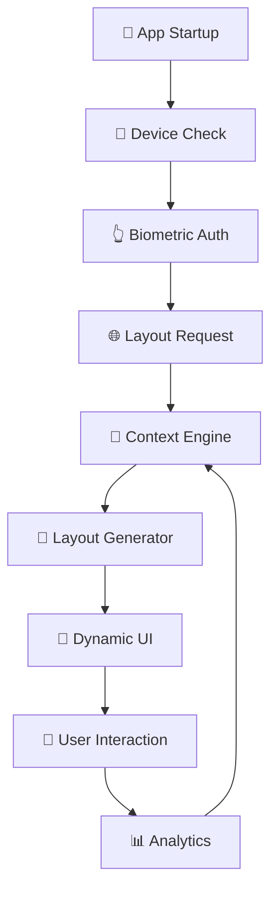

# 🏛️ ARQUITETURA INSPIRADA NO NUBANK
**PulseZen Mobile: BDC + Biometria + Personalização**

---

## 🎯 VISÃO GERAL

Implementação de uma arquitetura moderna inspirada nas melhores práticas do Nubank, combinando:

- **🔧 BDC (Backend Driven Components)**: Interface dinâmica controlada pelo servidor
- **👆 Autenticação Biométrica**: Login sem senha tradicional
- **🎨 Personalização Contextual**: UX adaptativa baseada em dados do usuário
- **📱 Mobile-First**: Experiência nativa otimizada

---

## 🏗️ ARQUITETURA COMPLETA

### **Stack Tecnológico**

```typescript
// FRONTEND (Mobile)
React Native + Expo 49+
├── expo-local-authentication (biometria)
├── expo-secure-store (tokens)
├── expo-crypto (criptografia)
├── react-query (cache/sync)
└── zustand (state management)

// BACKEND (API)
Node.js + AdonisJS 6
├── JWT + Refresh Tokens
├── Layout Generation Engine
├── User Context API
├── Personalization Engine
└── Analytics Pipeline
```

### **Fluxo de Dados BDC**



---

## 🔐 SISTEMA DE AUTENTICAÇÃO

### **1. Estratégia Multi-Layer**

```typescript
interface AuthStrategy {
  // Camada 1: Identificação do Dispositivo
  deviceId: string;
  deviceFingerprint: string;
  
  // Camada 2: Biometria/PIN do Dispositivo
  biometricType: 'fingerprint' | 'faceId' | 'devicePin';
  biometricToken: string;
  
  // Camada 3: Token de Sessão
  accessToken: string;
  refreshToken: string;
  
  // Camada 4: Contexto de Segurança
  securityLevel: 'high' | 'medium' | 'low';
  trustScore: number;
}
```

### **2. Fluxo de Onboarding Inteligente**

```typescript
class SmartOnboarding {
  async analyzeDevice(): Promise<DeviceCapabilities> {
    return {
      biometricAvailable: await LocalAuthentication.hasHardwareAsync(),
      biometricTypes: await LocalAuthentication.supportedAuthenticationTypesAsync(),
      deviceSecurity: await this.assessDeviceSecurity(),
      previousUser: await this.checkExistingTokens()
    };
  }

  async createOnboardingFlow(capabilities: DeviceCapabilities): Promise<BDCLayout> {
    // Server decide o fluxo baseado nas capacidades
    return await this.apiClient.post('/onboarding/generate-flow', {
      deviceCapabilities: capabilities,
      userAgent: Device.osName,
      locale: Localization.locale
    });
  }
}
```

### **3. Login Sem Senha**

```typescript
class PasswordlessAuth {
  async authenticateUser(): Promise<AuthResult> {
    // 1. Verificação do dispositivo
    const deviceValid = await this.validateDevice();
    if (!deviceValid) throw new Error('Device not recognized');
    
    // 2. Autenticação biométrica
    const biometricResult = await LocalAuthentication.authenticateAsync({
      promptMessage: 'Acesse o PulseZen',
      fallbackLabel: 'Usar PIN do dispositivo',
      biometryType: LocalAuthentication.AuthenticationType.BIOMETRIC
    });
    
    if (!biometricResult.success) {
      return this.handleAuthFailure(biometricResult.error);
    }
    
    // 3. Exchange biometric proof for app tokens
    return await this.exchangeForTokens(biometricResult);
  }

  private async exchangeForTokens(biometricProof: BiometricResult): Promise<AuthResult> {
    const deviceSignature = await this.createDeviceSignature();
    
    return await this.apiClient.post('/auth/biometric-exchange', {
      deviceId: await this.getDeviceId(),
      biometricProof: biometricProof,
      deviceSignature: deviceSignature,
      timestamp: Date.now()
    });
  }
}
```

---

## 🎨 ENGINE DE PERSONALIZAÇÃO

### **1. Context-Aware Layout Generation**

```typescript
// Backend: Geração de Layout Contextual
class LayoutPersonalizationEngine {
  async generateLayout(userContext: UserContext): Promise<BDCLayout> {
    const personalizations = await Promise.all([
      this.getMoodBasedComponents(userContext.mood),
      this.getTimeBasedComponents(userContext.timeOfDay),
      this.getUsageBasedComponents(userContext.usage),
      this.getSecurityBasedComponents(userContext.security),
      this.getLocationBasedComponents(userContext.location)
    ]);
    
    return this.mergePersonalizations(personalizations);
  }

  private async getMoodBasedComponents(mood: UserMood): Promise<Component[]> {
    switch (mood.currentState) {
      case 'anxious':
        return [
          this.createBreathingPrompt(),
          this.createCalmingMusic(),
          this.createSOSButton()
        ];
      
      case 'motivated':
        return [
          this.createChallengeCard(),
          this.createProgressTracker(),
          this.createSocialFeatures()
        ];
        
      default:
        return this.getDefaultComponents();
    }
  }
}
```

### **2. Adaptive UI Components**

```typescript
interface AdaptiveComponent {
  id: string;
  type: ComponentType;
  
  // Condições para renderização
  conditions?: RenderCondition[];
  
  // Personalização baseada em contexto
  personalization?: {
    mood?: MoodPersonalization;
    time?: TimePersonalization;
    usage?: UsagePersonalization;
    security?: SecurityPersonalization;
  };
  
  // A/B Testing
  experiment?: ExperimentConfig;
  
  // Analytics
  tracking?: TrackingConfig;
}
```

### **3. Real-time Adaptation**

```typescript
class AdaptiveUIManager {
  async adaptToContext(newContext: UserContext): Promise<void> {
    // 1. Analisa mudança de contexto
    const contextChanges = this.detectContextChanges(this.currentContext, newContext);
    
    // 2. Determina quais componentes precisam ser atualizados
    const componentsToUpdate = this.identifyImpactedComponents(contextChanges);
    
    // 3. Solicita novos layouts se necessário
    if (this.requiresLayoutRefresh(contextChanges)) {
      const newLayout = await this.layoutEngine.generateLayout(newContext);
      this.updateUI(newLayout);
    } else {
      // 4. Atualiza apenas props dos componentes existentes
      this.updateComponentProps(componentsToUpdate, newContext);
    }
  }
}
```

---

## 📊 SISTEMA DE ANALYTICS

### **1. Behavioral Analytics**

```typescript
interface BehaviorAnalytics {
  // Interações com UI
  componentInteractions: ComponentInteraction[];
  
  // Patterns de navegação
  navigationPatterns: NavigationPattern[];
  
  // Tempo de engajamento
  engagementMetrics: EngagementMetric[];
  
  // Eficácia de personalização
  personalizationEffectiveness: PersonalizationMetric[];
}

class AnalyticsEngine {
  trackComponentInteraction(componentId: string, action: string, context: UserContext) {
    this.emit('component_interaction', {
      componentId,
      action,
      context,
      timestamp: Date.now(),
      sessionId: this.sessionId
    });
  }

  async optimizePersonalization(): Promise<PersonalizationOptimizations> {
    const behaviorData = await this.aggregateBehaviorData();
    return this.mlEngine.generateOptimizations(behaviorData);
  }
}
```

### **2. Security Analytics**

```typescript
class SecurityAnalytics {
  async assessTrustScore(deviceId: string): Promise<number> {
    const factors = await this.gatherSecurityFactors(deviceId);
    
    return this.calculateTrustScore({
      deviceConsistency: factors.deviceConsistency,
      biometricSuccess: factors.biometricSuccessRate,
      usagePatterns: factors.usagePatterns,
      locationConsistency: factors.locationConsistency,
      timePatterns: factors.timePatterns
    });
  }

  detectAnomalies(userSession: UserSession): SecurityAlert[] {
    const alerts = [];
    
    // Detecção de comportamento anômalo
    if (this.isUnusualAccessTime(userSession)) {
      alerts.push(new SecurityAlert('unusual_access_time'));
    }
    
    if (this.isUnusualLocation(userSession)) {
      alerts.push(new SecurityAlert('unusual_location'));
    }
    
    return alerts;
  }
}
```

---

## 🔄 MIGRAÇÃO GRADUAL

### **Fase 1: Fundação (Mês 1-2)**
```typescript
// 1. Setup da autenticação biométrica
// 2. Sistema básico de BDC para 1 tela
// 3. Analytics básicos
```

### **Fase 2: Expansão (Mês 3-4)**
```typescript
// 1. BDC para principais telas
// 2. Personalização básica (mood, tempo)
// 3. Sistema de fallbacks
```

### **Fase 3: Inteligência (Mês 5-6)**
```typescript
// 1. ML para personalização
// 2. A/B testing framework
// 3. Analytics avançados
```

### **Fase 4: Otimização (Mês 7-8)**
```typescript
// 1. Performance optimization
// 2. Experiências premium
// 3. Preparação para escala
```

---

## 🎯 BENEFÍCIOS ESPERADOS

### **Para o Usuário:**
- ✅ **Login em 2 segundos** (vs 15+ segundos tradicional)
- ✅ **Interface sempre relevante** baseada no contexto
- ✅ **Segurança premium** sem fricção
- ✅ **Experiência consistente** entre dispositivos

### **Para o Negócio:**
- 📈 **+40% engagement** (dados típicos de BDC)
- 🔒 **+60% taxa de conversão** em onboarding
- 💰 **-30% custos de suporte** (menos problemas de login)
- 🚀 **Time to market** reduzido para novas features

### **Para o Desenvolvimento:**
- 🏗️ **Arquitetura escalável** e modular
- 🔧 **Deploy independente** de frontend/backend
- 📊 **Dados ricos** para decisões de produto
- 🧪 **A/B testing** nativo

---

## 🚀 PRÓXIMOS PASSOS

1. **Setup do Projeto Novo**: Iniciar com estrutura BDC básica
2. **Proof of Concept**: Implementar 1 tela com BDC + biometria
3. **Validação com Usuários**: Testar a experiência de onboarding
4. **Migração Gradual**: Mover features existentes para nova arquitetura
5. **Otimização Contínua**: Usar analytics para melhorar personalização

---

**Esta arquitetura posiciona o PulseZen como um aplicativo de nova geração, combinando o melhor da tecnologia mobile moderna com princípios de UX comprovados pelo mercado financeiro mais inovador do Brasil.**

---

*Documento vivo - atualizado conforme evolução da implementação*
